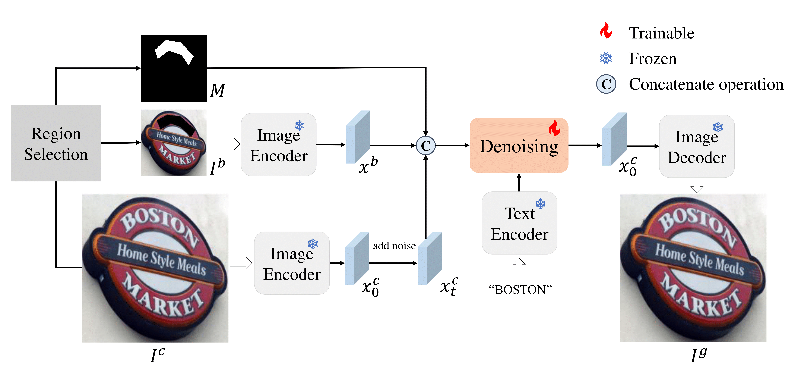

# The implementation of Enhancing Scene Text Detectors with Realistic Text Image Synthesis Using Diffusion Models

**Accepted by Computer Vision and Image Understanding**

This repository contains the implementation of **DiffText**. **[Paper Link](https://www.sciencedirect.com/science/article/abs/pii/S1077314224003059)**

> Scene text detection techniques have garnered significant attention due to their wide-ranging applications. However, existing methods have a high demand for training data, and obtaining accurate human annotations is labor-intensive and time-consuming. As a solution, researchers have widely adopted synthetic text images as a complementary resource to real text images during pre-training. Yet there is still room for synthetic datasets to enhance the performance of scene text detectors. We contend that one main limitation of existing generation methods is the insufficient integration of foreground text with the background. To alleviate this problem, we present the \textbf{Diff}usion Model based \textbf{Text} Generator (\textbf{DiffText}), a pipeline that utilizes the diffusion model to seamlessly blend foreground text regions with the background's intrinsic features. Additionally, we propose two strategies to generate visually coherent text with fewer spelling errors. With fewer text instances, our produced text images consistently surpass other synthetic data in aiding text detectors. Extensive experiments on detecting horizontal, rotated, curved, and line-level texts demonstrate the effectiveness of DiffText in producing realistic text images.

<p align="center">
  
</p>


# Data

The DiffText 10K dataset used in the paper can be downloaded here: [GoogleDrive](https://drive.google.com/file/d/12RAxpqByyTo3f1JR2hHThBlpE9hY62m8/view?usp=drive_link)

# Environment Setup
To set up the environment, please refer to the provided requirements.txt file.

# Model Training
## Prepare the Training Dataset
Download the text-image training dataset used in the paper from [Baidu Netdisk](https://pan.baidu.com/s/1HbWcPUTp9niOS9WrC4H8lw) (Extraction Code: inem)

## Run the Training Script
Navigate to the textfussion directory and execute the following command to train the generation model:
```python
cd textfussion
sh ./my_inpainting/new_paradigm_train.sh
```

# Synthetic Dataset Creation
Once the model training is complete, generate a synthetic dataset by running:
```python
python ./my_inpainting/my_build_synth_data_baseline.py
```

# Text Detection Experiment
## Configure Dataset Paths
Navigate to the mmocr/configs/textdet/ directory and set up the paths to your text-image dataset.

## Run the Detection Experiment
After configuring the dataset paths, execute the following script to start the detection experiment:
```python
cd mmocr
./my_train.sh
```

# Citation
If you find this work helpful in your research, please consider citing our paper:
```BibTeX
@article{fu2025enhancing,
  title={Enhancing scene text detectors with realistic text image synthesis using diffusion models},
  author={Fu, Ling and Wu, Zijie and Zhu, Yingying and Liu, Yuliang and Bai, Xiang},
  journal={Computer Vision and Image Understanding},
  volume={250},
  pages={104224},
  year={2025},
  publisher={Elsevier}
}
```
